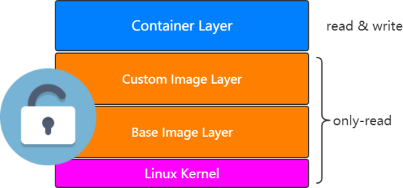

## 1 Image

>  说白了，image就是由一层一层的layer组成的。

### 1.1 官方image

>  https://github.com/docker-library

### 1.2 Dockerfifile

详见下列Dockerfifile文件中常见语法

#### 1.2.1 FROM

> 指定基础镜像，比如FROM ubuntu:16.04

````dockerfile
FROM ubuntu:14.04
````

#### 1.2.2 RUN

在镜像内部执行一些命令，比如安装软件，配置环境等，换行可以使用""

```dockerfile
RUN groupadd -r mysql && useradd -r -g mysql mysql
```

#### 1.2.3 ENV

设置变量的值，`ENV MYSQL_MAJOR 5.7`，可以通过`docker run --e key=value`修改，后面可以直接使

用`${MYSQL_MAJOR}`

````dockerfile
ENV MYSQL_MAJOR 5.7
````

#### 1.2.4 LABEL

设置镜像标签

````dockerfile
LABEL email="albertini_peter@163.com"
LABEL name="albertini_peter"
````

#### 1.2.5 VOLUME

指定数据的挂在目录

````dockerfile
VOLUME /var/lib/mysql
````

#### 1.2.5 COPY

将主机的文件复制到镜像内，如果目录不存在，会自动创建所需要的目录，注意只是复制，不会提取和

解压

````dockerfile
COPY docker-entrypoint.sh /usr/local/bin/
````

#### 1.2.6 ADD

将主机的文件复制到镜像内，和COPY类似，只是ADD会对压缩文件提取和解压

````dockerfile
ADD application.yml /opt/itcrazy2016/
````

#### 1.2.7 WORKDIR

指定镜像的工作目录，之后的命令都是基于此目录工作，若不存在则创建

```dockerfile
WORKDIR /usr/local 
WORKDIR tomcat 
RUN touch test.txt
```

> 会在/usr/local/tomcat下创建test.txt文件

```dockerfile
WORKDIR /root 
ADD app.yml test/
```

>  会在/root/test下多出一个app.yml文件

#### 1.2.8 CMD

容器启动的时候默认会执行的命令，若有多个CMD命令，则最后一个生效

````dockerfile
CMD ["mysqld"] 
或
CMD mysqld
````

#### 1.2.9 ENTRYPOINT

与CMD的不同, docker run执行时，会覆盖CMD的命令，而ENTRYPOINT不会

```dockerfile
ENTRYPOINT ["docker-entrypoint.sh"]
```

#### 1.2.10 EXPOSE

指定镜像要暴露的端口，启动镜像时，可以使用-p将该端口映射给宿主机

````dockerfile
EXPOSE 3306
````

### 1.3 Dockerfile实战

- 创建一个Spring Boot项目

- 写一个controller

  ````java
  @RestController 
  public class DockerController { 
      @GetMapping("/dockerfile") 
      @ResponseBody 
      String dockerfile() { 
          return "hello docker" ; 
      } 
  }
  ````

- mvn clean package打成一个jar包，在target下找到`demo-0.0.1-SNAPSHOT.jar` ，上传到docker环境的宿主机里指定目录【例如:springboot-demo】下，并在改目录下创建Dockerfile

  ````dockerfile
  FROM openjdk:8 
  MAINTAINER superalbertini 
  LABEL name="dockerfile-demo" version="1.0" author="superalbertini" 
  COPY demo-0.0.1-SNAPSHOT.jar dockerfile-image.jar 
  CMD ["java","-jar","dockerfile-image.jar"]
  ````

- 基于Dockerfile构建镜像 

  ```shell
  $docker build -t test-docker-image .
  ```

- 基于image创建container

  ```shell
  $docker run -d --name demo01 -p 6666:8080 test-docker-image 
  ```

- 查看启动日志

  ````shell
  $docker logs demo01
  ````

- 宿主机上访问`curl localhost:6666/dockerfile`

  ```tex
  hello docker 
  ```


### 1.4 镜像仓库

#### 1.4.1 docker hub

> hub.docker.com
>
> superalbertini登录

- 在docker机器上登录

  ````shell
  $docker login
  ````

- 输入用户名和密码

- `docker push superalbertini/ubuntu-bigdata-cluster-base`

  > 注意镜像名称要和docker id一致，不然push不成功

- 给image重命名，并删除掉原来的

  ````shell
  $docker tag ubuntu-bigdata-cluster-base superalbertini/ubuntu-bigdata-cluster-base
  $docker rmi -f superalbertini/ubuntu-bigdata-cluster-base
  ````

- 再次推送，刷新hub.docker.com后台，发现成功

- 别人下载，并且运行

  ```shell
  $docker pull superalbertini/ubuntu-bigdata-cluster-base
  $docker run -d --name demo01 -p 6661:8080 superalbertini/ubuntu-bigdata-cluster-base
  ```

#### 1.4.2 阿里云docker hub

> 阿里云docker仓库
>
> https://cr.console.aliyun.com/cn-hangzhou/instances/repositories

- 登录阿里云Docker Registry

```shell
$sudo docker login --username=superalbertini registry.cn-hangzhou.aliyuncs.com
```

用于登录的用户名为阿里云账号全名，密码为开通服务时设置的密码。

您可以在访问凭证页面修改凭证密码。

- 从Registry中拉取镜像

```shell
$sudo docker pull registry.cn-hangzhou.aliyuncs.com/docker-registry-peter/k8s-repo:[镜像版本号]
```

- 将镜像推送到Registry

```shell
$sudo docker login --username=superalbertini registry.cn-hangzhou.aliyuncs.com

$sudo docker tag [ImageId] registry.cn-hangzhou.aliyuncs.com/docker-registry-peter/k8s-repo-images:[镜像版本号]

$sudo docker push registry.cn-hangzhou.aliyuncs.com/docker-registry-peter/k8s-repo-images:[镜像版本号]
```

请根据实际镜像信息替换示例中的[ImageId]和[镜像版本号]参数。

#### 1.4.3 搭建Docker Harbor

- 访问github上的harbor项目 

   https://github.com/goharbor/harbor 

- 下载版本，比如[v2.0.0]

  https://github.com/goharbor/harbor/releases 

- 找一台安装了docker-compose，上传并解压`tar -zxvf xxx.tar.gz` 

- 进入到harbor目录 

  > 修改harbor.cfg文件，主要是ip地址的修改成当前机器的ip地址 
  >
  > 同时也可以看到Harbor的密码，默认是Harbor12345 

- 安装harbor，需要一些时间

  ```shell
  $sh install.sh
  ```

- 浏览器访问服务器ip，输入用户名和密码即可 

#### 1.5 Image常见操作

- 查看本地image列表 

  ```shell
  $docker images 
  $docker image ls 
  ```

- 获取远端镜像

  ````shell
  $docker pull
  ````

- 删除镜像

  ````shell
  $docker image rm imageid 
  $docker rmi -f imageid 
  $docker rmi -f $(docker image ls) 删除所有镜像 
  ````

- 运行镜像 

  ````shell
  $docker run image
  ````

- 发布镜像

  ````shell
  $docker push
  ````

## 2 Container

> 既然container是由image运行起来的，那么是否可以理解为container和image有某种关系？



> 注意:其实可以理解为container只是基于image之后的layer而已，也就是可以通过docker run image创建出一个container出来。

### 2.1 container到image

> 可以通过docker commit命令基于一个container重新生成一个image，但是一般不建议这么做，因为这样做的话完全不知道image是如何生成的。

### 2.2 container的资源限制

> `查看资源情况` ：docker stats

#### 2.2.1 container的内存限制

```shell
--memory Memory limit 
```


如果不设置 --memory-swap，其大小和memory一样 

``` shell
$docker run -d --memory 100M --name tomcat1 tomcat
```

#### 2.2.2 container的CPU限制

```shell
--cpu-shares 权重 
$docker run -d --cpu-shares 10 --name tomcat2 tomcat
```

#### 2.2.3 图形化资源监控

> https://github.com/weaveworks/scope

````shell
$sudo curl -L git.io/scope -o /usr/local/bin/scope 
$sudo chmod a+x /usr/local/bin/scope 
$scope launch 39.100.39.63
````

````shell
# 停止scope scope stop
$scope stop

# 同时监控两台机器，在两台机器中分别执行如下命令
$scope launch ip1 ip2
````

### 2.3 container常见操作

1. 根据镜像创建容器

   ```shell
   $docker run -d --name -p 9090:8080 my-tomcat tomcat
   ```

2. 查看运行中的container

   ````shell
   $docker ps
   ````

3. 查看所有的container[包含退出的]

   ````shell
   $docker ps -a
   ````

4. 删除container

   ````shell
   $docker rm containerid 
   $docker rm -f $(docker ps -a) 删除所有container
   ````

5. 进入到一个container中

   ````shell
   $docker exec -it container bash
   ````

6. 根据container生成image 

   ````shell
   $docker commit
   ````

7. 查看某个container的日志

   ````shell
   $docker logs container
   ````

8. 查看容器资源使用情况

   ````shell
   $docker stats
   ````

9. 查看容器详情信息

   ````shell
   $docker inspect container
   ````

10. 停止/启动容器

    ````shell
    $docker stop/start container
    ````

## 3 底层技术支持

> 注意：Docker是基于Linux Kernel的Namespace、CGroups、UnionFileSystem等技术封装成的一种自定义容器格式，从而提供一套虚拟运行环境。

**Namespace**：用来做隔离的，际上修改了应用进程看待整个计算机“视图”，即它的“视线”被操作系统做了限制，只能“看到”某些指定的内容,比如pid[进程]、net[网络]、mnt[挂载点]等。

**CGroups**: Controller Groups用来做资源限制，它最主要的作用，就是限制一个进程组能够使用的资源上限，包括 CPU、内存、磁盘、网络带宽等等。

**Union file systems**：也叫 UnionFS，最主要的功能是将多个不同位置的目录联合挂载（union mount）到同一个目录下。

- 比如，我现在有两个目录 A 和 B，它们分别有两个文件：

  ````shell
  $ tree
  .
  ├── A
  │  ├── a
  │  └── x
  └── B
    ├── b
    └── x
  ````

  


